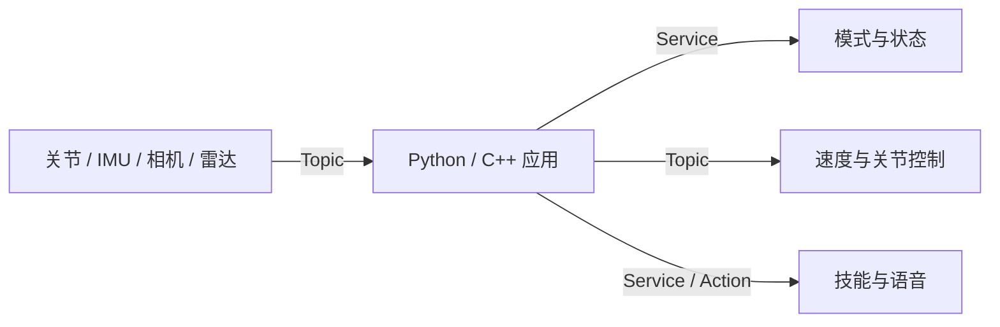

# 接口总览



## 常用端点

| 属性 | 值 |
| --- | --- |
| 查询模式 | `get_robot_mode` · `crb_ros_msg/srv/GetRobotMode` |
| 设置模式 | `/set_robot_mode` · `crb_ros_msg/srv/SetRobotMode` |
| 查询状态 | `get_robot_state_srv_hl` · `crb_ros_msg/srv/GetRobotState` |
| 行走速度 | `/navigation/cmd_vel` · `geometry_msgs/msg/Twist` |
| 上身控制 | `/upper_body_debug/joint_cmd` · `crb_ros_msg/msg/UpperJointData` |
| 全身控制与反馈 | `/motion/debug/joint_cmd`、`/motion/debug/joint_state` · `crb_ros_msg/msg/JointStateData` |
| 关节／IMU | `/joint_states` · `sensor_msgs/msg/JointState`；`/imu` · `sensor_msgs/msg/Imu` |
| 上身／全身调试开关 | `/motion/upper_body_debug`、`/motion/whole_body_debug` · `std_srvs/srv/SetBool` |
| 语音服务 | `/voice_svr` · `crb_ros_msg/srv/Voice` |
| 技能事件 | `/casbot/event_service` · `crb_ros_msg/srv/ActionEvent` |
| 预设动作 | `/basic_action_play` · `crb_ros_msg/action/BasicActionPlay` |

当前核对基准为 hl_motion main `c3b2902`。导航开关为 `/motion/switch_nav_mode`，false 返回 IDLE_MODE。
标准全身接口 `/motion/joint_cmd`、`/motion/joint_state` 使用 `sensor_msgs/msg/JointState`。
带增益接口使用 `/motion/debug/` 前缀，反馈依赖 WHOLE_BODY_DEBUG 模式。
语音和技能事件由外部组件提供；上表列出集成入口，不代表 hl_motion 自带这些服务。
详细前提与模式说明见[运动控制](../dev-guide/motion-control.md)。

完整字段见[消息](../api/messages.md)、[服务](../api/services.md)、[动作](../api/actions.md)。
一行调用见[接口全覆盖](../api/interfaces.md)。

```bash
ros2 topic list -t
ros2 service list -t
ros2 action list -t
```
