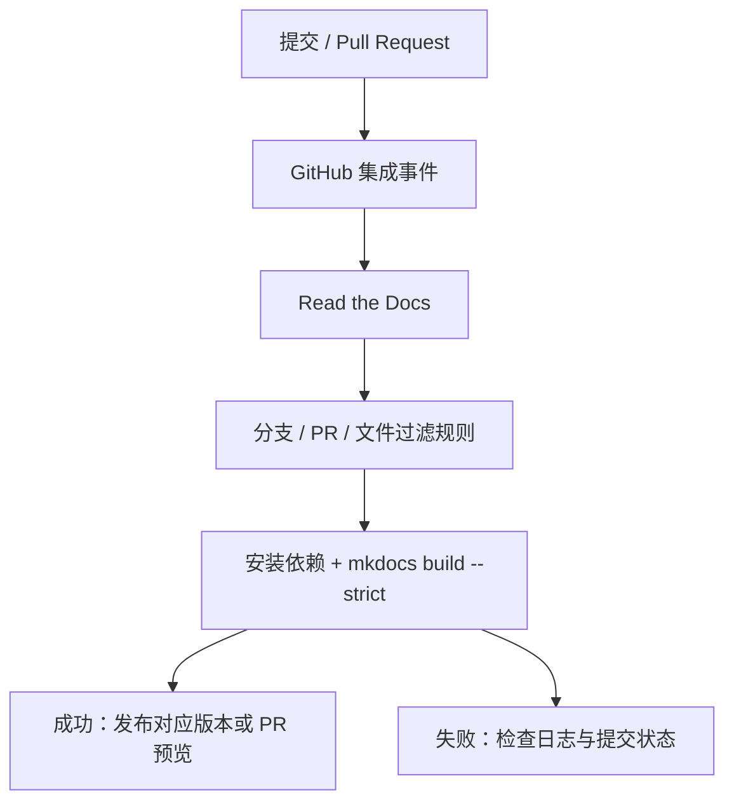

# 文档构建与 RTD 部署

文档使用 **MkDocs + Material + Read the Docs Community**，与 SDK 源码放在同一个公开仓库。
导航与阅读体验参考个人 demo，所有源码链接指向 `CasbotRobotics/casbot2-ros2-sdk`。

## 本地开发

在 SDK 根目录使用独立的 Python 3.11+ 环境，文档构建不需要 ROS 2：

```bash
python3.11 -m venv .venv-docs
source .venv-docs/bin/activate
python -m pip install -r examples/config/requirements.txt
python -m mkdocs serve -f examples/config/mkdocs.yml
```

默认预览地址为 `http://127.0.0.1:8000/`；修改 `examples/docs/` 后自动刷新。
修改外部源文件时重新触发构建，或使用 `python -m mkdocs serve -f examples/config/mkdocs.yml --watch crb_ros_msg --watch examples`。

```bash
python -m mkdocs build -f examples/config/mkdocs.yml --strict
```

构建产物位于 `site/`，不提交到 Git。缺失导航、页面、图片和锚点会使严格构建失败。

## 配置与内容维护

| 属性 | 值 |
| --- | --- |
| `examples/config/readthedocs.yaml` | RTD 的操作系统、Python 3.11、依赖安装和 MkDocs 构建配置 |
| `examples/config/requirements.txt` | 文档依赖，锁定已验证的 MkDocs 1.x 与主题／插件版本 |
| `examples/config/mkdocs.yml` | 导航、主题、中文搜索、Mermaid、语言 Tab 与生成插件 |
| `examples/docs/` | 按功能分组的 Markdown 与共享图片 |
| `examples/scripts/gen_docs.py` | 从 `crb_ros_msg/CMakeLists.txt` 注册清单生成三类接口参考 |
| `examples/docs/changelog.md` | 版本说明的唯一维护源 |
| `examples/` | 开发指南代码块直接引用的 C++ / Python 源文件 |

接口页根据原始定义生成字段表、源码定义、类型构造示例和 CLI 核查命令，不依赖 ROS 2 安装。
生成文件只存在于构建过程，修改原始 msg/srv/action 后重新构建即可。图中不会将未注册文件描述成可用接口。
版本日期插件仅在 CI / RTD 中启用，显示最后提交日期；本地预览不显示提交日期，避免未提交迁移文件产生错误时间信息。

## 第一次接入 RTD Community

1. 登录 Read the Docs Community，导入公开仓库 `CasbotRobotics/casbot2-ros2-sdk`。
2. 选择实际使用的项目名，默认分支设为 `main`，在 RTD 项目设置中将配置文件路径指定为 `examples/config/readthedocs.yaml`。
3. 按平台引导完成 GitHub 集成，触发首次 Build。
4. 在 Builds 查看依赖安装、生成页和 MkDocs 严格构建结果。
5. 核对正式站点的图片、Mermaid、中文搜索和源文件编辑链接，再将正式 URL 写入 README。

`site_url` 使用 RTD 提供的 `READTHEDOCS_CANONICAL_URL`。项目名决定站点地址，不能保证方案中的示例域名一定被分配，也不要沿用个人 demo 域名。
当前配置不会创建 RTD 项目或修改仓库的 Webhook；这些是托管平台的一次性接入步骤。

## Webhook 与构建触发



若采用 Webhook 集成，使用 RTD 项目 Integrations 页面实际提供的 Payload URL 和 Secret；不要将 Secret 写入仓库。
在 GitHub Settings → Webhooks 检查对应事件及最近投递记录，配置 `application/json`，按集成说明接收 push 与 pull_request 事件。
使用 GitHub App 集成时按其安装范围和项目设置核查，不强制另建重复 Webhook。

**路径过滤不是仅靠本仓库 YAML 自动生效。** GitHub App 集成可在 RTD Automation Rules 中配置 Changed files 过滤；
其他接入方式可按官方指南使用 `post_checkout` 与退出码 183 取消不需要的构建。
至少将以下依赖纳入文档触发范围：

```text
examples/docs/**
examples/config/mkdocs.yml
examples/config/requirements.txt
examples/config/readthedocs.yaml
examples/scripts/gen_docs.py
crb_ros_msg/**
examples/**
examples/docs/changelog.md
```

新增接口字段和开发指南所引用的源代码也会改变生成文档，不能只监听 `examples/docs/`。
没有配置文件过滤时允许 RTD 正常构建，避免首次构建、标签或多提交更新被错误跳过。

## Pull Request 预览

在 RTD 项目的 Settings → Pull request builds 核对预览设置；新项目通常默认开启，已有项目应检查实际配置。
创建／更新 PR 后，在 GitHub 的 RTD 检查项中打开对应预览，确认分支内容正确再合并。
这需要 GitHub 集成成功并具有相应的状态回写权限。

| 问题 | 排查方法 |
| --- | --- |
| push 后没有构建 | 核对集成范围、分支规则、路径过滤和 Webhook 最近投递状态 |
| Webhook 投递失败 | 核对项目实际 Payload URL、Secret 与事件配置，不公开粘贴 Secret |
| 构建失败 | 在 RTD Builds 查看完整日志；先在本地执行严格构建 |
| PR 没有预览 | 检查 Pull request builds、GitHub 集成与检查项权限 |
| 找不到 Webhook | 查看使用的是 GitHub App 还是 Webhook 集成，按项目 Integrations 页面恢复连接 |

## 配置模板与本地检查

仓库不再跟踪 `.github/workflows/` 等隐藏配置。原工作流作为普通 YAML 模板保存在
`examples/config/workflows/`，不会触发 GitHub Actions。模板中的安装、构建与测试步骤供维护者参考。

本地仍可运行：

```bash
bash examples/scripts/build.sh
bash examples/scripts/test.sh
python -m mkdocs build -f examples/config/mkdocs.yml --strict
```

Read the Docs 配置同样以普通文件 `examples/config/readthedocs.yaml` 保存。
若使用 RTD，需要在平台配置自定义配置文件路径；仓库本身不会自动完成托管接入。
构建产物和本机忽略规则不上传，提交时仅选择源码、文档与配置文件。

## 版本与自定义域名

使用 RTD 托管时，在 RTD 中管理分支／标签版本与默认版本；自定义域名也在项目设置中配置。
方案中的 `mike deploy` / `gh-pages` 属于另一种版本产物发布方式，仅在另行选择该托管方案时采用，不能据此认定 RTD 已发布。
当前未设置 `extra.version.provider: mike`，避免显示没有版本产物支持的切换器。

参考：[RTD 构建配置](https://docs.readthedocs.com/platform/stable/config-file/v2.html)、
[条件构建](https://docs.readthedocs.com/platform/stable/guides/build/skip-build.html)、
[PR 预览](https://docs.readthedocs.com/platform/stable/pull-requests.html)。
